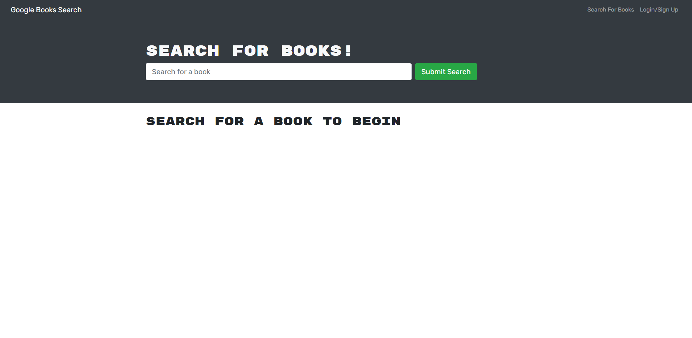

# Book Search Engine

## Description

A book search engine for searching for and saving your favourite books. Login functionality is added so you can have books saved to your account perpetually.

## Installation

No installation required, navigate to https://book-search-engine01.herokuapp.com/ to use the application.

## Usage

Search for books using the 'Search for a book' search bar. In order to save books to your account, login/sign up in the top right corner.

## Credits

Michael Sinn - https://github.com/MichaelSinn

## License

This project is covered under the license of MIT. More information about this
license: https://opensource.org/licenses/MIT
